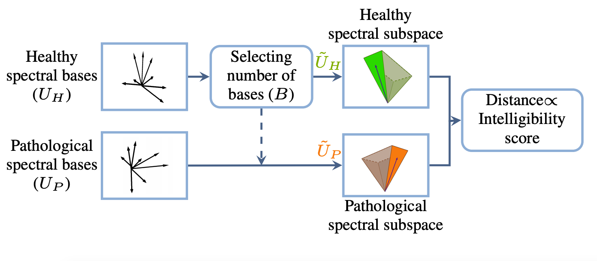

Abstract: 
Speech intelligibility is an important assessment criterion of the
communicative performance of pathological speakers. To assist
clinicians in their assessment, time- and cost-efficient automatic
intelligibility measures offering a repeatable and reliable assessment are desired.
In this paper, we propose to automatically assess pathological speech intelligibility based on a distance measure between
the subspaces of spectral patterns of the pathological speech signal and of a fully intelligible (healthy) speech signal.
To extract the subspace of spectral patterns we investigate
two linear decomposition methods, i.e., Principal Component
Analysis and Approximate Joint Diagonalization. Pathological
speech intelligibility is then derived using a Grassman distance
measure which quantifies the difference between the extracted
subspaces of pathological and healthy speech. Experiments
on an English database of Cerebral Palsy patients show that
the proposed intelligibility measure is significantly correlated
with subjective intelligibility ratings. In addition, comparisons
to state-of-the-art measures show that the proposed subspacebased measure achieves a high performance with a significantly
lower computational cost and without imposing any constraints
on the speech material of the speakers.

 

  

Schematic representation of the proposed subspacebased pathological speech intelligibility measure 

<!--

      Links:
      <a href="https://github.com/PJanbakhshi/Pjanbakhshi.github.io/blob/master/_posts/2020-02-28-test-markdown.md">tag1</a>
      <a href="https://github.com/PJanbakhshi/Pjanbakhshi.github.io/blob/master/_posts/2020-02-28-test-markdown.md">tag2</a>

-->

 

Type:&nbsp;&nbsp;&nbsp;
<a class="btn btn-outline-success"><i class="fas fa-book-open" aria-hidden="true"></i>&nbsp;{{- tag -}}&nbsp;JOURNAL PAPER</a>
 
 

Links:&nbsp;&nbsp;&nbsp;
<a href="https://ieeexplore.ieee.org/document/9293030" class="btn btn-outline-success"><i class="fas fa-link" aria-hidden="true"></i>&nbsp;{{- tag -}}&nbsp;DOI</a>
<a href="https://github.com/PJanbakhshi/Pjanbakhshi.github.io/blob/master/docs/INTERSPEECH_poster.pdf" class="btn btn-outline-success"><i class="far fa-file-pdf" aria-hidden="true"></i>&nbsp;{{- tag -}}&nbsp;POSTER</a>

<!--<a href="https://github.com/PJanbakhshi/Pjanbakhshi.github.io/blob/master/_posts/2020-02-28-test-markdown.md" class="btn btn-outline-success"><i class="far fa-file-pdf" aria-hidden="true"></i>&nbsp;{{- tag -}}&nbsp;POSTER</a>-->

<!--<a href="https://github.com/PJanbakhshi/Pjanbakhshi.github.io/blob/master/_posts/2020-02-28-test-markdown.md" class="btn btn-outline-primary"><i class="fas fa-link" aria-hidden="true"></i>&nbsp;{{- tag -}}&nbsp;(DOI)</a>-->

