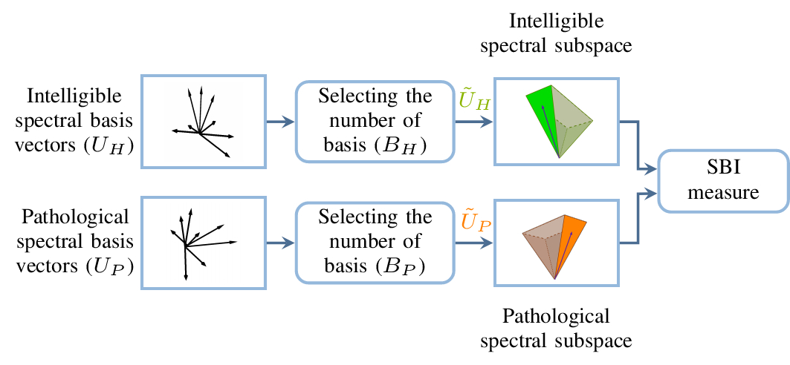

Abstract: Competitive state-of-the-art automatic pathological speech intelligibility measures typically rely on regression training on a large number of features, require a large amount of healthy speech training data, or are applicable only to phonetically balanced scenarios where healthy and pathological speakers utter the same utterances.
  As a result, their performance in unseen data is unsatisfactory, and they cannot be used in low-resource languages or in phonetically unbalanced scenarios.
  To overcome these drawbacks, we propose a subspace-based intelligibility(SBI) measure.  
The SBI measure operates based on the hypothesis that dominant spectral patterns of pathological speech differ from intelligible speech (where the pathological and intelligible speech signals do not need to match in phonetic content), with the difference increasing as pathological speech intelligibility decreases. The SBI measure uses a minimal number of speech recordings to compute dominant spectral basis vectors spanning intelligible and pathological speech. The subspaces spanned by the intelligible and pathological spectral basis vectors are compared to each other through a subspace distance measure, which is directly used~(i.e., without any training) as the pathological speech intelligibility estimate.
  Exploiting psychoacoustic evidence on the importance of spectral modulation cues to the perceived speech intelligibility and clinical evidence on the degradation of these cues in pathological speech, we show that the power of the proposed SBI measure lies in capturing the effect of spectral modulation degradation.
  To be able to additionally track possible degradations in the temporal structure of the pathological speech signal, we also propose two extensions of the SBI measure by incorporating short-time temporal information.
Experimental results for different languages and speech pathologies show that the proposed intelligibility measures yield high and significant correlations with subjective intelligibility ratings, while not requiring any regression training or a large number of healthy speech recordings and being applicable to phonetically unbalanced scenarios. 

 

  

Schematic representation of the proposed subspace-based intelligibility measure. Intelligible and pathological spectral basis vectors are obtained from intelligible (i.e., healthy) and pathological utterances. Low-dimensional spectral subspaces spanned by the most dominant intelligible and pathological spectral basis are created, where the number of dominant spectral basis vectors are automatically found. The pathological intelligibility score is computed as the distance between intelligible and pathological spectral subspaces. 

 

Type:&nbsp;&nbsp;&nbsp;
<a class="btn btn-outline-success"><i class="fas fa-book-open" aria-hidden="true"></i>&nbsp;{{- tag -}}&nbsp;JOURNAL PAPER</a>
 
 

Links:&nbsp;&nbsp;&nbsp;
<a href="https://ieeexplore.ieee.org/abstract/document/9099394" class="btn btn-outline-success"><i class="fas fa-link" aria-hidden="true"></i>&nbsp;{{- tag -}}&nbsp;DOI</a>

<a href="https://github.com/PJanbakhshi/Pjanbakhshi.github.io/blob/master/docs/SBI_slides.pdf" class="btn btn-outline-success"><i class="far fa-file-pdf" aria-hidden="true"></i>&nbsp;{{- tag -}}&nbsp;SLIDES</a>

