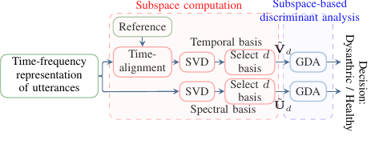

Abstract: To assist the clinical diagnosis and treatment of speech dysarthria, automatic dysarthric speech detection techniques providing reliable and cost-effective assessment are indispensable. 
Based on clinical evidence on spectro-temporal distortions associated with dysarthric speech, we propose to automatically discriminate between healthy and dysarthric speakers exploiting spectro-temporal subspaces of speech.
Spectro-temporal subspaces are extracted using singular value decomposition, and dysarthric speech detection is achieved by applying a subspace-based discriminant analysis.
Experimental results on databases of healthy and dysarthric speakers for different languages and pathologies show that the proposed subspace-based approach using temporal subspaces is more advantageous than using spectral subspaces, also outperforming several state-of-the-art automatic dysarthric speech detection techniques.

  

Block diagram of the proposed subspace-based approach for dysarthric speech detection 

 

  

Illustration of SVD for obtaining spectral and temporal basis vectors spanning the spectral and temporal dimension of the TF representation of an utterance 

<!--

      Links:
      <a href="https://github.com/PJanbakhshi/Pjanbakhshi.github.io/blob/master/_posts/2020-02-28-test-markdown.md">tag1</a>
      <a href="https://github.com/PJanbakhshi/Pjanbakhshi.github.io/blob/master/_posts/2020-02-28-test-markdown.md">tag2</a>

-->

 

Type:&nbsp;&nbsp;&nbsp;
<a class="btn btn-outline-success"><i class="fas fa-book-open" aria-hidden="true"></i>&nbsp;{{- tag -}}&nbsp;JOURNAL PAPER</a>
 
 

Links:&nbsp;&nbsp;&nbsp;
<a href="https://ieeexplore.ieee.org/document/9293030" class="btn btn-outline-success"><i class="fas fa-link" aria-hidden="true"></i>&nbsp;{{- tag -}}&nbsp;DOI</a>

<a href="../docs/GDA.pdf" target="_blank">PDF  class="btn btn-outline-success"><i class="far fa-file-pdf" aria-hidden="true"></i>&nbsp;{{- tag -}}&nbsp;SLIDES</a>

<embed src="../docs/GDA.pdf" width="100%" height="850px" class="btn btn-outline-success"><i class="far fa-file-pdf" aria-hidden="true"></i>&nbsp;{{- tag -}}&nbsp;SLIDES</>

<a href="https://github.com/PJanbakhshi/Pjanbakhshi.github.io/blob/master/_posts/2020-02-28-test-markdown.md" class="btn btn-outline-success"><i class="far fa-file-pdf" aria-hidden="true"></i>&nbsp;{{- tag -}}&nbsp;POSTER</a>

<!--<a href="https://github.com/PJanbakhshi/Pjanbakhshi.github.io/blob/master/_posts/2020-02-28-test-markdown.md" class="btn btn-outline-primary"><i class="fas fa-link" aria-hidden="true"></i>&nbsp;{{- tag -}}&nbsp;(DOI)</a>-->

